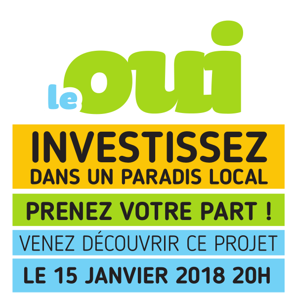

+++
authors = ["OJML"]
title = "Le 15 Janvier, Investissez dans un paradis local !"
description = "Pour découvrir ce projet, participer à son financement, Rdv le lundi 15 janvier à 20h salle des Fêtes de Soisy-sur-Seine,et prendre une part de galette des rois…"
date = 2017-12-17
[extra]
banner = "vue-archiacconcept.jpg"
+++

## Pourquoi investir dans le Oui ?

* Pour les avantages fiscaux
* Si vous êtes assujetti l’IR, déduisez 18% de votre investissement.
* Si vous êtes assujetti à l’ISF, déduisez 50%.
* Pour décider de l’utilisation de votre épargne
* Vous savez exactement où va votre argent et comment il est utilisé.
* Choisissez un investissement local qui porte vos valeurs
* Pour économiser les frais financiers
* Avec ce financement local pas de frais financiers, ni de frais de gestion.
* Pour participer à un projet ambitieux et coopératif qui redynamise le tissu local, les commerces et le lien social.

#### Une coopérative d’entrepreneurs

OUI je me lance ! est une Société Coopérative d’Intérêt Collectif (SCIC). Sa gouvernance respecte les principes démocratiques : 1 personne = 1 voix.

Aujourd’hui, 40 sociétaires indépendants, entrepreneurs, associations ou citoyens participent à cette aventure collective.

#### Confort et convivialité

1 500 m 2 d’espaces locatifs sur 3 étages en plein centre-ville de Soisy-sur-Seine.

* 700 m 2 de bureaux
* 1 espace de coworking
* Des espaces communs comme à la maison
* Une piscine pour les professionnels de santé (kiné) ou de loisirs (bébé-nageur, aquagym)
* Un laboratoire de cuisine pour accueillir des chefs
* Des salles polyvalentes pour les réunions, colloques…

Pour découvrir ce projet, participer à son financement,

Rdv le lundi 15 janvier à 20h salle des Fêtes de Soisy-sur-Seine,

et prendre une part de galette des rois…

