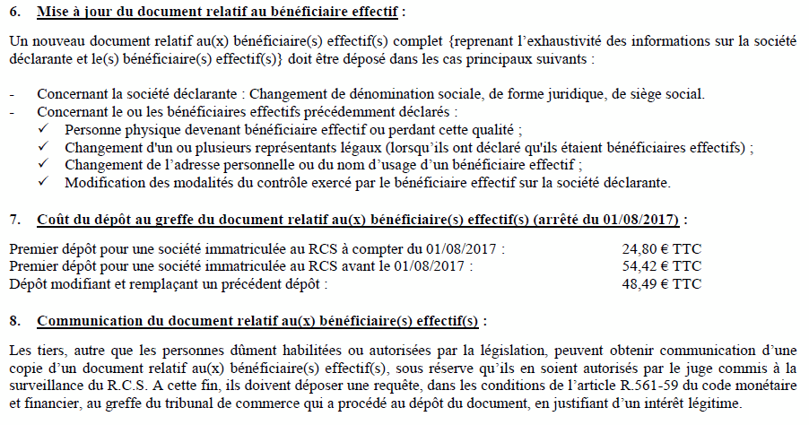

+++
authors = ["OJML"]
title = "Le Registre des Bénéficiaires Effectifs. Peut-on y échapper ?"
description = "Amis entrepreneurs et dirigeants de PME, J’espère pour vous que vous n’êtes pas passé à côté de cette nouvelle obligation."
date = 2018-03-13
[extra]
banner = "pourchange.png"
+++

Amis entrepreneurs et dirigeants de PME, J’espère pour vous que vous n’êtes pas passé à côté de cette nouvelle obligation. **Avant le 1er avril 2018, vous devez absolument déposer un document au greffe et vous acquitter de 54,42 €**

Il n’y a pas à discuter ! Et si vous ne le faîtes pas les sanctions sont très lourdes. 6 mois de prison et 7 500 € d’amende.

Au début on croirait à un canular, surtout avec cette date de 1er avril. Mais après moult vérifications, il y a bien un texte de loi ([article 139 loi Sapin 2 du 9 Décembre 2016 : Légifrance](https://www.legifrance.gouv.fr/affichTexteArticle.do;jsessionid=88BA6EE8EF87C192D31F9CBADECAF700.tplgfr36s_2?idArticle=JORFARTI000033558619&cidTexte=JORFTEXT000033558528&dateTexte=29990101&categorieLien=id)). Sous couvert de lutte contre le blanchiment, voici donc une nouvelle « taxe » représentant  50€ x 3 millions d’entreprises = 150 millions d’euros. Sans compter les mises à jour à 48,49 €…

En principe, on n’aime pas trop le discours caricatural du dirigeant qui pousse des jérémiades contres les charges, les impôts, les taxes et la lourdeur administrative. Etant promoteur du modèle coopératif (SCIC, SCOP) et même partisan de l’entreprise libérée et transparente, on aurait plutôt tendance à se réjouir de voir une nouvelle mesure contribuant à la lutte contre le blanchiment.

Sauf que…

Sauf que là **on se moque de l’entrepreneur** !

* La loi Sapin prévoyait une simplification administrative. Nous voici avec une nouvelle démarche qui ne manque pas de redondance avec d’autres formalités.
* Le candidat [Macron avait en ligne de mire les rentes injustifées des greffiers](https://www.capital.fr/economie-politique/infogreffe-l-injustifiable-rente-des-greffiers-que-macron-veut-casser-1050463). Voici une nouvelle rente pour les greffes !
* Les informations demandées, à savoir l’identité des personnes détenant plus de 25% de l’entreprise, pourraient très bien figurer sans surcoût, lors du dépôt des comptes au greffe.
* Il s’agit d’un mode « déclaratif » dont on perçoit mal l’efficacité en terme de lutte contre le terrorisme.
* Enfin, toute modification entraîne un nouveau dépôt et de nouveaux frais !

Avec d’autres amis entrepreneurs, **nous avons testé cette nouvelle démarche**. Vous avez deux options :

- Par voie postale.
  * Il vous faut télécharger puis imprimer autant de bulletin pdf (à compléter numériquement ou au stylo).
  * Envoyer cela accompagné d’un chèque de 54,42 €
- Par voie numérique sur infogreffe.fr
  * Télécharger (sic!) le même bulletin puis compléter (numériquement ou en imprimant, écrivant, scannant…)
  * Téléverser le document
  * Obtenir une signature numérique (**+2,50 €**) en fournissant les scans des cartes d’identité
  * Payer par carte bleue (54,42 € plus un supplément de **+1,14 €** pour une raison échappe au commun des mortels)

Bref, vous pensiez gagner du temps et faire gagner du temps à l’administration mais non seulement c’est plus coûteux par voie numérique, mais encore vous pouvez être sûr qu’en bout de chaîne, les données que vous renseignez ne seront pas traitées. Simplement stockées.

Qu’il y ait des procédures et des formalités, cela est normal. Mais depuis tant d’années où l’on nous promet une __simplification__, voire un __droit à l’erreur__ avec l’administration, force est de constater que l’on applique encore les mêmes recettes.

Il suffit de constater le plébiscite pour des propositions comme celle-ci sur pacte-entreprise (registre unique de publicité des informations relatives aux entreprises) et de constater derrière qu’en terme de registre, vous avez societe.com (organe privée mais de loin le plus consulté), actulegales (le syndicat des journaux habilités à recevoir les annonces légales) PPLE (groupement d’intérêt public) infogreffe.fr (comme son nom l’indique) et BODACC (pour déclarer la même chose que dans le journal…)

## Aucun recours possible ?

Quand j’ai parlé de cette histoire d’obligation Registre des Bénéficiaires Effectifs à mon réseau d’amis dirigeants, j’ai d’abord été étonné de voir que très peu étaient au courant. Pourtant, 3 millions de dirigeants qui s’apprêtent à payer sans comprendre une nouvelle procédure, ça devrait remuer certaines instances représentatives.

Puis j’ai vu que tout le monde était résigné. Avec un ton, dans la caricature évoquée ci-dessus du dirigeant qui rouspète d’être tondu ! J’ai alors interrogé la toile pour savoir s’il y avait un peu de grogne dans les forums ! Hélas, je me sens bien seul !

Tout juste des questionnements [sur le site des CUMA](http://www.cuma.fr/france/actualites/registre-des-beneficiaires-effectifs-les-cuma-sont-concernees)

> L’objectif étant de démontrer que la notion de « bénéficiaire effectif » n’est pas en correspondance avec la qualité d’adhérent de Cuma, afin de s’exonérer de cette formalité ou l’adapter.

Et de la [FNSEA](http://www.fdsea28.fr/declaration-des-beneficiaires-effectifs-la-fnsea-monte-au-creneau-actualite-numero-1210.php) (locale)

> Une demande d’exonération du dispositif a été adressée aux ministres de l’Intérieur, de la Justice, de l’Economie et des Finances, et de l’Agriculture, afin de les alerter sur le surcoût occasionné par cette mesure chez les sociétés agricoles (estimé à dix millions d’euros). Ainsi que sur le fait que la collecte de ces informations fait double emploi vis à vis des obligations de publicité pesant d’ores et déjà sur les sociétés et groupements agricoles, tels que les EARL, les Gaec, les SCEA et les GFA.
> 
> Pour l’ensemble de ces structures, l’administration a déjà connaissance des bénéficiaires effectifs, via le registre du commerce et des sociétés, ou par la préfecture, pour les Gaec.

Au final, une contestation bien faible et bien dérisoire. Pourquoi ?

## Peut-on s’opposer à la déclaration du Registre des Bénéficiaires Effectifs ?

Au vu des éléments législatifs invoqués, il semble assez clair que non. Cependant, le fait que certaines instances négocient une dérogation et la certitude que les trois quarts des entreprises vont zapper cette obligation, laisse à penser que c’est le bon moment d’interroger la pertinence d’un tel dispositif.

Il existe une bonne pratique de plus en plus répandue dans le monde associatif, à savoir la publication en ligne des **statuts** et des **rapports d’activité**. Plus médiatiques, les récentes mesures sur la transparence dans la vie publique (déclarations d’intérêts, patrimoine des élus…) ont permis également de restaurer une certaine confiance avec le milieu politique. A ma connaissance, il s’agit de mesures non pénalisantes en tout cas non payantes.

Car tout le fond du problème est là. Si l’on paye, c’est pour avoir un service. Quand on paye une taxe, une charge ou une formalité type enregistrement, on obtient un service. Par contre **payer pour rendre un service** voilà qui est plutôt agaçant !

La sanction en cas de manquement à cette obligation est étonnamment très lourde :

> ATTENTION : Le fait de ne pas déposer au greffe ou de déposer, de manière inexacte ou incomplète le document relatif au bénéficiaire effectif constitue un délit pénal (article L. 561-49 du code monétaire et financier).

## Exigeons la transparence ! Exigeons la gratuité !

C’est pourquoi, nous, simple et modeste coopérative Oui je me lance, réseau d’entrepreneurs rassemblant 50 sociétés en Essonne, nous nous permettons d’interpeller l’Etat et le Conseil National des Greffiers et Tribunaux de Commerce en demandant :

* La gratuité de cette formalité
* La garantie que ces informations soient réellement efficaces pour lutter de manière préventive contre le blanchiment.

Nous invitons toutes les personnes concernées à [signer la pétition publiée sur Change.org](https://www.change.org/p/conseil-national-des-greffiers-des-tribunaux-de-commerce-rendre-gratuite-la-formalit%C3%A9-de-d%C3%A9claration-du-registre-des-b%C3%A9n%C3%A9ficiaires-effectifs)
