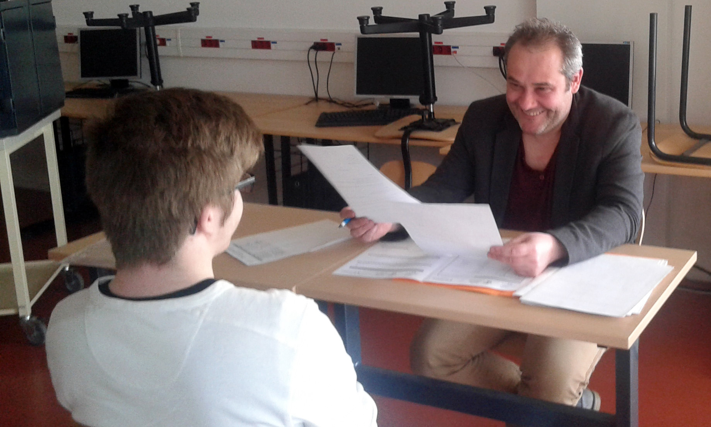

+++
authors = ["OJML"]
title = "130 élèves ont passé leur premier entretien d’embauche au sein du lycée !"
description = "Pour la 3ème année consécutive, des faux entretiens d’embauche de 20 minutes se sont déroulés dans l’enceinte du lycée professionnel Jacques Prévert à Combs-la-Ville (77)."
date = 2018-05-15
[extra]
banner = "lyceecombs-02.jpg"
+++

Pour la 3ème année consécutive, des faux entretiens d’embauche de 20 minutes se sont déroulés dans l’enceinte du lycée professionnel Jacques Prévert à Combs-la-Ville (77). Cette année, ce sont 130 lycéens qui ont pu se préparer grâce au réseau d’entrepreneurs _Oui je me lance !_

Même s’il s’agissait de simulation, le stress, l’envie d’apprendre et progresser était souvent palpable chez les futurs bacheliers.

Valérie Lauberthe, professeur d’économie et gestion, référente _décrochage scolaire_ dans l’établissement francilien, coordonne le bon déroulé sur ces 3 journées qui permettent à 138 élèves dans différentes filières d’avoir leur premier entretien d’embauche.

> « Il est rare de pouvoir avoir un « entraînement » de ce type avant un vrai entretien. Cela permet aux élèves de limiter les appréhensions et inquiétudes. C’est surtout une chance pour eux de formaliser et partager leur projet avec un langage et une attitude adaptés au monde du travail. Et de recevoir des conseils pour mettre toutes les chances de leur côté ».
> 
> Valérie Lauberthe, référente du programme

Arnaud DUVERNE, président de la coopérative Oui je me lance, avait initié ces simulations d’entretien au lycée Robert Doisneau de Corbeil-Essonnes (91). Depuis 2013, c’est près de 1 000 élèves qui ont pu se confronter, en toute bienveillance, à ces entretiens menés par une trentaine d’entrepreneurs bénévoles.

> « Dans notre réseau d’entrepreneurs, nous avons une diversité de professionnels qui me semble à l’image de la diversité des modalités d’embauche. Avec Oui je me lance, nous continuons à décompartimenter, lancer des passerelles entre les différentes générations et univers ».
>
> Arnaud Duverne, Président de la SCIC Oui je me lance !

[Télécharger le communiqué de presse](@CP-CombsLaVille-JacquesPrevert.pdf)
