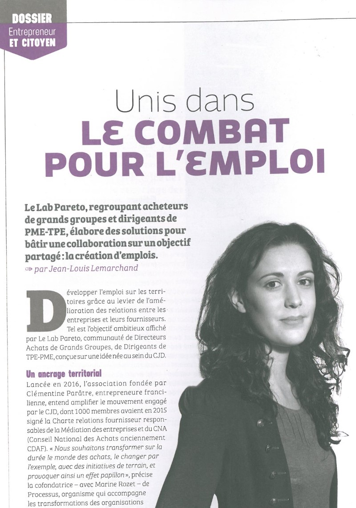
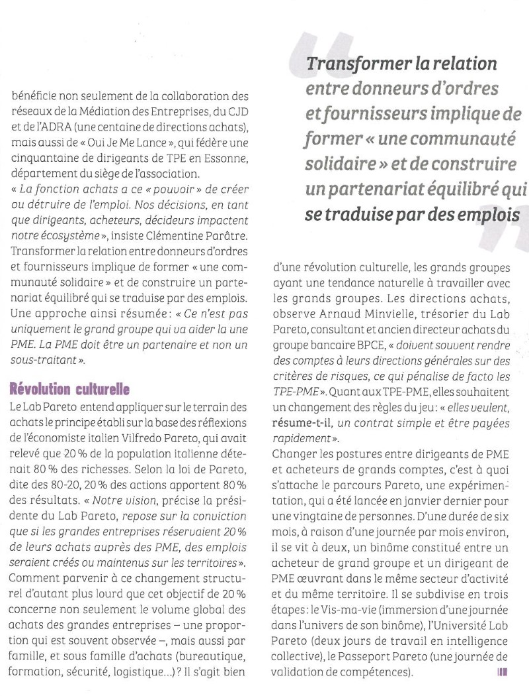

+++
authors = ["OJML"]
title = "Clémentine PARÂTRE, le Lab Pareto à l’honneur dans la revue Dirigeant"
description = "Le Lab Pareto, c’est une association montée par une adhérente historique de Oui je me lance, Clémentine Parâtre, fondatrice de la société Processus."
date = 2018-06-01
[extra]
banner = "couv-2.jpg"
+++

Le **Lab Pareto**, c’est une association montée par une adhérente historique de Oui je me lance, Clémentine Parâtre, fondatrice de la société Processus.

Le [Lab Pareto](http://labpareto.com/) est un think&do tank regroupant acheteurs de grands groupes et dirigeants de TPE-PME.

Cette initiative a été incubée au sein de Oui je me lance en 2017 et a pris son autonomie en 2018.

Clémentine est à l’honneur dans [le dernier numéro de la revue Dirigeant](http://www.dirigeant.fr/011-1892-Dirigeant-n122.html), éditée par le [CJD](http://cjd.net/) (Centre des Jeunes Dirigeants).

> Le Lab Pareto, regroupant acheteurs de grands groupes et dirigeants de PME-TPE, élabore des solutions pour bâtir une collaboration sur un objectif partagé : la création d’emplois.
> 
> Transformer la relation entre donneurs d’ordres et fournisseurs implique de former « une communauté solidaire » et de construire un partenariat équilibré qui se traduise par des emplois

