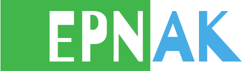
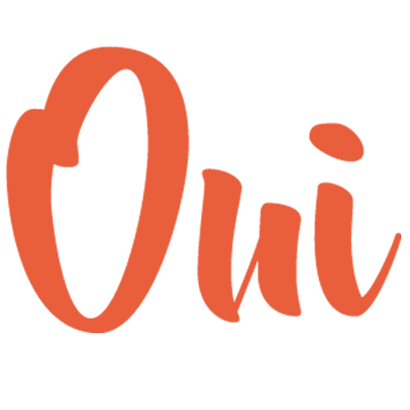

+++
authors = ["OJML"]
title = "Partenariat avec l’EPNAK (Etablissement de Reconversion Professionnelle)"
description = "À partir du 6 Juillet, Oui je me lance et toute la clique d’entrepreneurs du 12 rue Notre-Dame à Soisy-sur-Seine, déménagent au 5 boulevard Aristide Briand."
date = 2018-07-05
[extra]
banner = "Sans-titre.png"
+++

**L’École de Reconversion Professionnelle** Gabriel et Charlotte Malleterre est un établissement public géré par l’EPNAK (Établissement Public National Antoine Koenigswarter) se situant à Soisy-sur-Seine.

Elle accueille et forme des **adultes en situation de handicap** et des militaires en reconversion professionnelle, précédemment orientés par la MDPH. Elle fait bénéficier d’un accompagnement médico-social à 180 stagiaires.

Son objectif est de donner une seconde chance à des adultes justifiant du statut de travailleur handicapé vers un **nouvel emploi**. Ce centre offre plusieurs **formations diplômantes et qualifiantes**, dans le but d’une réinsertion sereine dans le monde du travail.

Oui je me lance est une Société Coopérative d’Intérêt Collectif (SCIC). Elle regroupe **70 sociétaires entrepreneurs**, indépendants, associations et citoyens. Elle gère un ***tiers-lieu de 1500 m²** en cours d’ouverture au coeur de **Soisy-sur-Seine**.

La société proposera en location des bureaux, des espaces de coworking, une cuisine, des salles de réunion et une piscine.

Son objectif est de sensibiliser le public scolaire à la **culture de la création et conduite d’entreprises** ; contribuer au développement économique local ou départemental en favorisant le **développement de réseaux** et les **échanges**.

---

Réunissant des valeurs communes, l’**EPNAK** et **OUI je me lance** s’associent en vue de créer deux nouvelles formations au sein de l’ERP : EPNAK ENTREPRENEUR ACADEMY (accompagnement dans la création d’entreprise) et EPNAK NUMÉRIQUE ACADEMY (développement des connaissances web).

_Ce partenariat est née d’une volonté commune d’innover, en créant de nouvelles opportunités aux personnes éloignées de l’emploi._

[Affiche du partenariat EPNAK OJML](affiche-partenariat-Epnak-BLANC.pdf)
