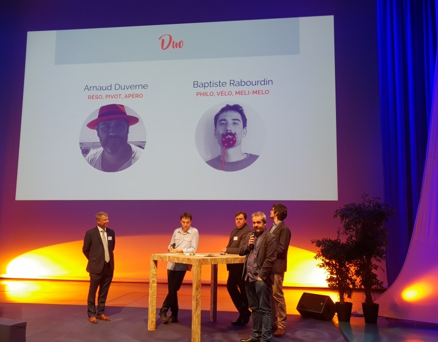

+++
authors = ["OJML"]
title = "Coup de cœur de La Fondation Banque Populaire"
description = "Jeudi 29 Novembre, au Génocentre d’Évry, devant 600 sociétaires de la Banque Populaire Rives de Paris, Arnaud et Baptiste ont présenté  le tiers-lieu coopératif le OUI."
date = 2018-12-11
[extra]
banner = "arton306.png"
+++

Jeudi 29 Novembre, au Génocentre d’Évry, devant 600 sociétaires de la Banque Populaire Rives de Paris, Arnaud et Baptiste ont présenté  le tiers-lieu coopératif le OUI.

Notre projet a en effet reçu un soutien moral et financier de la Fondation Banque Populaire à hauteur de 3 000 €.

Et cela nous a permis de rencontrer d’autres Soiséens, d’autres entrepreneurs qui vont rejoindre l’aventure.

Notre coopérative est fière d’être sociétaire et cliente de cette **banque proche et engagée**.

