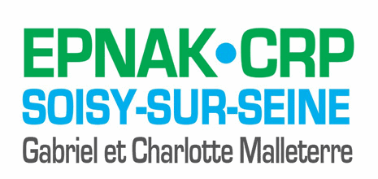

+++
authors = ["OJML"]
title = "EPNAK Academy Entrepreneur"
description = "EPNAK Academy Entrepreneur propose une formation et un accompagnement à toutes celles et ceux qui ont des talents, des compétences, l’envie d’entreprendre, de réussir et d’élargir ainsi leur opportunité d’insertion sociale et professionnelle."
date = 2019-04-10
[extra]
banner = "EPNAK-academy2JPEG.jpg"
+++

**EPNAK Academy Entrepreneur** propose une formation et un accompagnement à toutes celles et ceux qui ont des talents, des compétences, l’envie d’entreprendre, de réussir et d’élargir ainsi leur opportunité d’insertion sociale et professionnelle.

## EPNAK ACADEMY ENTREPRENEUR UNE PLATEFORME DE FORMATION DÉDIÉE À LA CRÉATION D’ENTREPRISE

_EPNAK Academy Entrepreneur_ propose une formation d’une durée de **3 mois** menée en partenariat avec la coopérative
« **Oui je me lance** ». Complète, pratique, immédiatement applicable, collaborative et modulaire elle permet de renforcer
les compétences entrepreneuriales des porteurs de projet et l’accompagnement dans leurs démarches.

## EPNAK ACADEMY ENTREPRENEUR UN PUBLIC DIVERSIFIÉ

* Les porteurs d’un projet de création ou de reprise d’entreprise.
* Les entrepreneurs ayant déjà créé leur entreprise.
* Les salarié(e)s souhaitant se réorienter professionnellement.
* Les demandeurs d’emploi.
* Les personnes en situation de handicap bénéficiant d’une reconnaissance RQTH (entrée sur notification de la MDPH).
* Les jeunes de moins de 26 ans inscrits dans des dispositifs d’accompagnement de parcours (Missions Locales, etc.).

## EPNAK ACADEMY ENTREPRENEUR UNE PÉDAGOGIE INNOVANTE

_EPNAK Academy Entrepreneur_ propose une offre de formation et de prestations adaptables qui se décline en quatre modules composés de 17 thèmes, incluant de multiples outils pédagogiques et mises en œuvre de partenariats.

* Utilisation de méthodes souples grâce à un parcours de formation modulaire.
* Développement du projet professionnel en temps réel
* Études de cas pratiques.
* Mise en situations réelles.
* Simulation d’entretiens.
* Échanges d’expérience.
* Accompagnement renforcé par le Pôle Médico Psycho-Social
* Coaching individualisé.
* Interventions de professionnels et d’une équipe pédagogique pluridisciplinaire.
* Témoignages de chefs d’entreprise.
* Formation en présentiel et en ligne.
* Validation de la formation : présentation des projets devant un jury de professionnels.
* Mise à disposition d’un espace de coworking.

## EPNAK ACADEMY ENTREPRENEUR UN PARCOURS DE FORMATION MODULAIRE

**4 MODULES** RÉPARTIS SUR 17 THÈMES

* Module 1 : Les fondamentaux de la **création d’entreprise**.
* Module 2 : Le cadre **juridique, fiscal et social**.
* Module 3 : Business plan et **finances**.
* Module 4 : La **commercialisation** du produit, du service

CONTENU DE LA FORMATION

* MODULE 1 : LES FONDAMENTAUX DE LA CRÉATION D’ENTREPRISE
  - Thème 1 – Évaluation du projet
  - Thème 2 – L’étude du marché
  - Thème 3 – Construction de sa stratégie globale
  - Thème 4 – Outils bureautiques et anglais des affaires
* MODULE 2 : LE CADRE JURIDIQUE, FISCAL ET SOCIAL
  - Thème 1 – Le choix du statut
  - Thème 2 – Responsabilité du dirigeant
  - Thème 3 – Régime fiscal de l’entreprise
* MODULE 3 : BUSINESS PLAN ET FINANCE
  - Thème 1 – Logique financière de l’entreprise
  - Thème 2 – Documents financiers
  - Thème 3 – L’équilibre financier
  - Thème 4 – Les sources de financement
  - Thème 5 – Le Business Plan
* MODULE 4 : LA COMMERCIALISATION DU PRODUIT, DU SERVICE
  - Thème 1 – La conclusion d’un contrat commercial
  - Thème 2 – Vendre son produit
  - Thème 3 – Réussir ses démarches commerciales
  - Thème 4 – Confiance en soi et gestion du stress
  - Thème 5 – Projection à long terme

À l’issue de la formation, une rencontre de bilan a lieu afin de clore officiellement ce temps d’accompagnement mais aussi d’indiquer les appuis ultérieurement mobilisables en cas de besoin.

## CONTACT

CRP Malleterre

Centre de Réadaptation Professionnelle

1 rue de l’Ermitage – CS 85202

91214 Soisy-sur-Seine Cedex

Roselyne Lange
 - Tél : [01 69 89 61 00](tel:+33169896100)
 - Port. : [06 62 12 97 88](tel:662129788)
 - [contact@onac-erp-soisy.fr](mailto:contact@onac-erp-soisy.fr)

[Télécharger la brochure](EPNAK-Academy-Entrepreneur.pdf)
