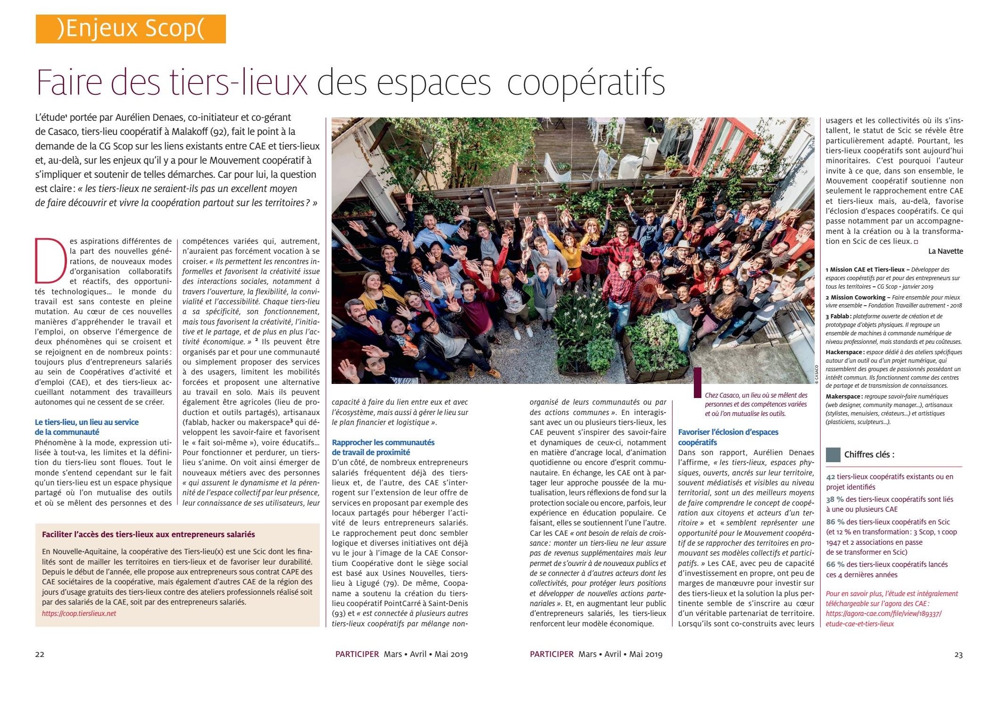

+++
authors = ["OJML"]
title = "Tiers-Lieu et coopérative – une évidence symbiotique"
description = "Le magazine des sociétés coopératives, Participer, consacre son dernier numéro aux liens entre tiers-lieux et CAE (Coopératives d’Activité et d’Emploi)."
date = 2019-05-04
[extra]
banner = "complémentaritéTLetCAE.png"
+++

Le magazine des sociétés coopératives, Participer, consacre son dernier numéro aux liens entre tiers-lieux et CAE (Coopératives d’Activité et d’Emploi). Étant nous-même en SCIC et développant le tiers-lieu le OUI à Soisy-sur-Seine, forcément ça nous intéresse… Mais comme on a conscience que ce sujet est « _to the happy few_ », nous nous permettons de vous faire une petite synthèse de l’article.

Bon, déjà rappelons ce qu’est un tiers-lieu. C’est tout simplement un bâtiment où se retrouvent des gens, souvent des entrepreneurs indépendants, pour partager des outils. **Ils sont sous le même toit…**

Quant à la CAE, il s’agit d’une entreprise coopérative permettant à des entrepreneurs indépendants, d’exercer leur activité sans avoir à créer leur propre structure juridique. **Ils sont sous le même abri…**

La première CAE a été créée en 1995 et cela représente aujourd’hui près de 10 000 « salariés-entrepreneurs » en France aujourd’hui. Pas loin de chez nous, il y a la [CAE Rurban Coop](https://ouijemelance.org/project/rurban-coop/), par exemple.

Les **tiers-lieux**, il y en a **partout** maintenant. Peut-être trop même. La définition est si large que le confusionnisme préexistant entre les incubateurs, clusters, couveuses, pépinières,… a de beaux jours devant lui.

Dans l’étude « CAE et Tiers-lieux : créer des ponts entre communautés de travail autonome sur les territoires au sein de lieux partagés », menée par Aurélien Denaes (Casaco à Malakoff), il est question de **1463 Tiers-lieux en France, dont 674 hors métropole**.

Et donc pour le moment **42 tiers-lieux coopératifs** ! Dont Oui je me lance bien entendu ! Nous faisons partie des 2/3 des tiers-lieux coopératifs lancés ces 4 dernières années.

Et donc 8 CAE qui travaillent à se rapprocher de ces tiers-lieux coopératifs. Quand on vous disait «  happy few » 😉

## Quelles complémentarités entre CAE et Tiers-Lieux ?

On sent bien que ces « réseaux d’entrepreneurs » et ces « bâtiments de travailleurs » ont quelque chose à se dire. L’article de Participer mentionne ce premier point : d’un côté les CAE en manque de visibilité et au modèle économique fragile. De l’autre des tiers-lieux souvent visibles et avec un modèle économique… fragile 😉

L’autre point c’est l’opportunité de faire vivre concrètement l’esprit coopératif, voire de le faire découvrir, grâce au tiers-lieu. Cela nous parle chez Oui je me lance car si notre histoire est un peu différente, nous avons sensibilisé les membres du réseau, tous indépendants, à notre vie coopérative. Et parfois suscité des envies de création coopérative !

Bref, sans vouloir spoiler et sans tomber dans le « [Nihil novi sub sole](https://fr.wikipedia.org/wiki/Nihil_novi_sub_sole) » du sage… rien de tel qu’un endroit sympa pour rencontrer des gens sympas… C’est pas très nouveau… mais c’est l’avenir.

