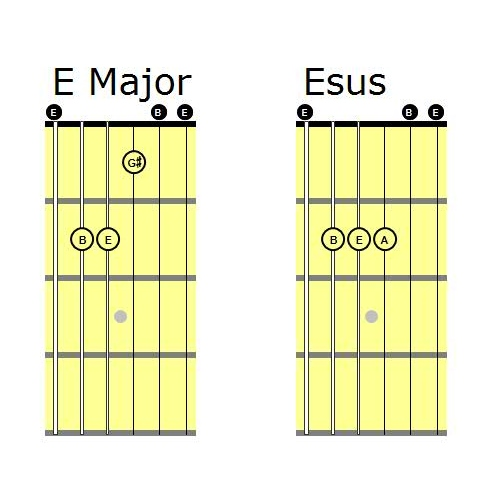

+++
authors = ["OJML"]
title = "Oui je me lance obtient l’agrément ESUS"
description = "L’agrément « Entreprise Solidaire d’Utilité Sociale » est délivré aux entreprises pour qui « l’argent n’est pas une finalité, mais un moyen ». On profite de ce petit tampon officiel pour vous rappeler ce qu’est l’économie sociale et solidaire."
date = 2019-05-24
[extra]
banner = "OJML-Agrément-ESUS-1.png"
+++

L’agrément « Entreprise Solidaire d’Utilité Sociale » est délivré aux entreprises pour qui « l’argent n’est pas une finalité, mais un moyen ». On profite de ce petit tampon officiel pour vous rappeler ce qu’est l’économie sociale et solidaire.

## Mais qu’est-ce que l’agrément ESUS  ?

L’agrément « Entreprise solidaire d’utilité sociale » ou agrément ESUS s’inscrit dans le cadre de la loi du 31 juillet 2014 relative à l’économie sociale et solidaire (article 11). Cette dernière a pour but de créer un écosystème favorable pour les entreprises solidaires et leur développement.

L’agrément ESUS permet donc de labelliser les entreprises les plus exigeantes socialement pour attirer des investisseurs privés au travers de l’épargne solidaire.

Ca c’est pour la partie officielle… Maintenant un peu de off 😉

Avant la loi Hamon de 2014, il existait un « agrément solidaire » qui permettait à certaines entreprises d’être éligibles à certains types de subventions. Rappelons que l’**économie sociale et solidaire** regroupe une typologie d’acteurs divers :

* les structures « historiques » de type « association », « coopérative », « mutuelle », « fondation ».
* les entreprises « classiques » (SA, SARL, SAS) qui contribuent à une économie plus solidaire et écologique (commerce équitable, agriculture bio, circuits courts, insertion…)

Pour aller vite, ce n’est pas parce que l’on est de l’économie sociale (statut juridique) que l’on a une finalité solidaire… Et ce n’est pas parce que l’on a un statut juridique neutre… que le profit est une finalité. Bref, le statut ESUS est supposé clarifier cette mixité en demandant aux structures qui en font la demande de respecter deux grands principes :

* une échelle de salaire « raisonnable » (en gros, le dirigeant ne peux pas gagner plus de dix fois le smic)
* le capital ne doit pas être disponible sur les marchés financiers

On pourra regretter qu’ESUS ne dise rien de la gouvernance, notamment sur la démocratie (le fameux 1 homme = 1 voix, conforme au statut coopératif).

Esus, c’est aussi un accord musical. Un Mi Supendu, qui se décompose en Mi, La et Si. Ca sonne plutôt jazzy. Et l’on va donc fêter cela en musique prochainement 😉

