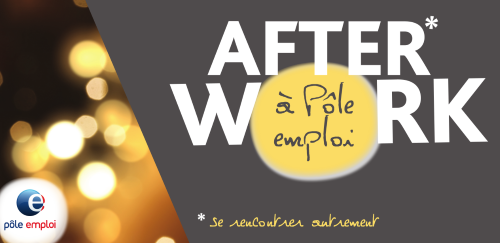
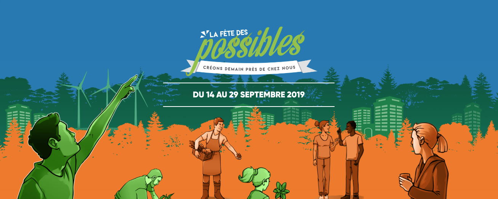

+++
authors = ["OJML"]
title = "Notre actualité de Septembre"
description = "Remise du Prix Fondation Banque Populaire. AfterWork inédit au Pole Emploi ! Intervention Table Ronde Salon des Micro Entrepreneurs. Fête des Possibles (Alternatives)."
date = 2019-09-17
[extra]
banner = "tous.png"
+++

## Remise du Prix Fondation Banque Populaire
_Mardi 24 Sept. à Paris_

Et de deux ! Après avoir reçu le prix coup de cœur en Décembre 2018, Oui je me lance a été retenu pour le prix départemental et recevra un nouveau prix d’une valeur de 1500 € notamment pour la promotion de l’entrepreneuriat

## AfterWork inédit au Pole Emploi !
_Jeudi 26 Sept. à Evry_

Une antenne de Pôle Emploi qui se met à faire des afterworks, c’est assez dingue, non ? Pour cette première, nous serons là et essaierons de présenter notre dispositif expérimental « Oui je trouve » (faire 3 stages en une seule fois). Et aussi parler de la formation [Epnak Entrepreneur Academy](@/blog/2019-04-10-epnak-academy/index.md)

## Intervention Table Ronde Salon des Micro Entrepreneurs
_Lundi 30 Sept. au Palais des Congrès, Paris_

Oui je me lance n’aurait pas pu être là sans France Active, et notamment Essonne Active. Alors, nous sommes heureux de pouvoir témoigner au salon SME pour répondre à la question « [Quels financements mobiliser pour créer votre entreprise ?](https://www.salonsme.com/2019/conferences/conference-quels-financements-mobiliser-pour-creer-votre-entreprise-764.html) »
## Fête des Possibles (Alternatives)
_Dimanche 29 Sept. Port aux Cerises, Draveil_

Pour la 3ème année consécutive, nous aurons le plaisir de tenir un stand (très léger le stand…) pour montrer que d’autres manières de travailler sont possibles sur notre territoire !

[Voir le site de la Fête des Possibles](https://cneet.org/?Fp19Presentation)
