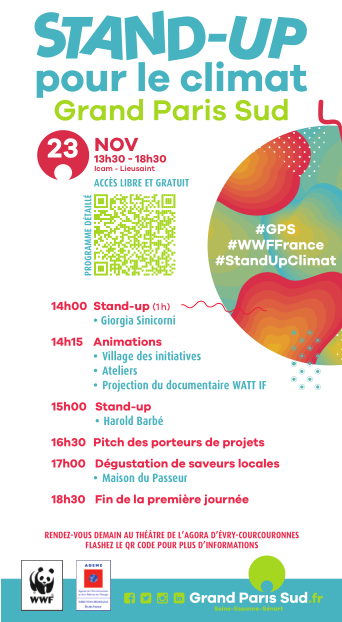

+++
authors = ["OJML"]
title = "Stand Up Pour le Climat Samedi 23 Novembre / Lieusaint"
description = "On participe au Stand Up pour le Climat, initié par l’agglomération Grand Paris Sud, l’ADEME et le WWF."
date = 2019-11-21
[extra]
banner = "standup.png"
+++

La Société Coopérative d’Intérêt Collectif _Oui je me lance !_ participe au Stand Up pour le Climat, initié par l’agglomération Grand Paris Sud, l’ADEME et le WWF.

Nous serons au « village des initiatives » l’après-midi pour présenter notre tiers-lieu en gestation à Soisy-sur-Seine. Quel rapport avec le climat ?

* **Relocaliser** l’activité économique, notamment dans les centre-villes, pour limiter les transports
* Concevoir des espaces de travail **exemplaires** en terme de consommations d’eau, d’énergies et de déchets
* Rappeler les vertus du modèle **coopératif** qui permet dans sa gouvernance d’impliquer toutes les parties prenantes. L’argent est un moyen, pas une finalité !

Des artistes seront présents et des ateliers seront animés sur les autres stands.

[Plus d’infos sur le site de Grand Paris Sud](https://projets.grandparissud.fr/news-index-portail-projets-gps/stand-up-pour-le-climat-tous-unis-pour-faire-bouger-les-lignes)
