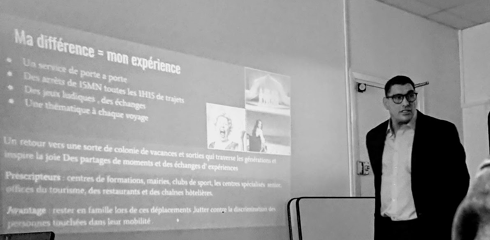

+++
authors = ["OJML"]
title = "1ère promotion EPNAK Entrepreneurs"
description = "La première formation « EPNAK Entrepreneur Academy« , 420h sur 3 mois, au sein du tiers-lieu Oui je me lance à Soisy-sur-Seine, s’est achevée le 20 Décembre 2019."
date = 2020-01-10
[extra]
banner = "epnak-20Decembre.png"
+++

> Ca m’a permis de coucher sur papier mes idées de manière structurée.
> Je vais créer dans les trois prochains mois
> 
> Brigitte, stagiaire de la formation EPNAK Entrepreneur Academy, future créatrice design

> Ca m’a permis d’y voir beaucoup plus clair et d’avoir des outils pour me lancer
> 
> Marc, stagiaire de la formation EPNAK Entrepreneur Academy, futur restaurant

La première formation « EPNAK Entrepreneur Academy« , 420h sur 3 mois, au sein du tiers-lieu Oui je me lance à Soisy-sur-Seine, s’est achevée le 20 Décembre 2019.

8 stagiaires,futurs entrepreneurs, ont pu suivre, 5 jours par semaine, 7h par jour une formation accélérée et complète (marketing, finances, commercial, communication, productivité, juridique…) afin de concrétiser leur projet.

Ils étaient entre les mains de 15 entrepeneurs du réseau Oui je me lance ainsi que de 10 intervenants extérieurs, tous entrepreneurs, venus partager leur expérience.

Cette formation, inédite par son format et sa destination, était un pari né d’une convention entre le Centre de Réinsertion Professionnelle EPNAK de Soisy, et de la coopérative SCIC Oui je me lance, réunissant 50 entrepreneurs établis sur Grand Paris Sud.

Le bilan est plus que positif puisque tous les stagiaires repartent avec une satisfaction totale. Point d’orgue de la formation, la matinée du 20 décembre où chacun a « pitché » son projet devant le jury.

> Paradoxalement, cette formation a été aussi très enrichissante pour les formateurs. Rares sont les occasions en effet, où des entrepreneurs peuvent transmettre leurs compétences et leurs expériences avec de futurs projets. Et parfois, il y a des coups de coeur. Sur les projets, sur les personnes… c’est un enrichissement réciproque.
> 
> Baptiste RABOURDIN, directeur Oui je me lance

Une seconde session aura lieu **fin Février**. Pour tout complément d’information, merci de se rapprocher de l’[EPNAK Malleterre à Soisy-sur-Seine](http://epnak.org).
