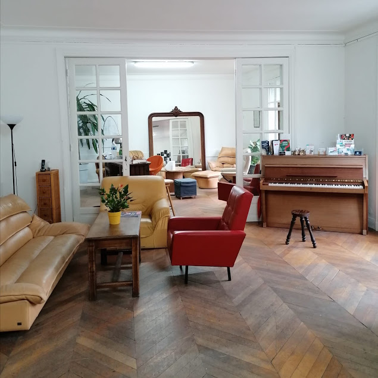
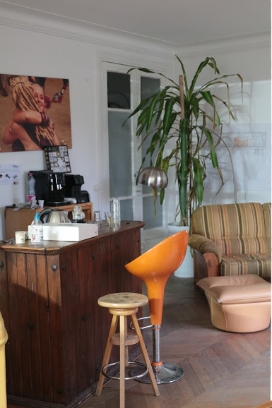
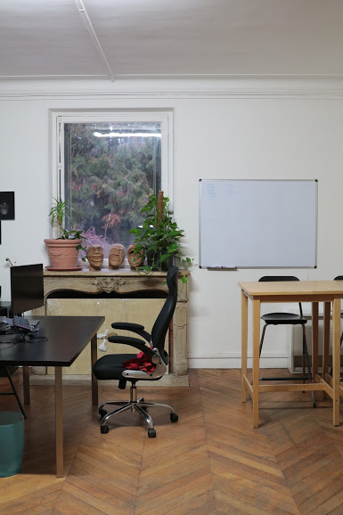

+++
authors = ["OJML"]
title = "Aristide Briand – nos locaux actuels"
description = "Installée en 2014 dans le cœur de ville de Soisy, notre petite communauté de 5 entrepreneurs s’est retrouvée à 20 au bout de quelques mois."
date = 2020-09-14
[extra]
banner = "PlancheLogos.png"
+++

Installée en 2014 dans le cœur de ville de Soisy, notre petite communauté de 5 entrepreneurs s’est retrouvée à 20 au bout de quelques mois. En 2018, nous avons déménagé de quelques mètres, au 5 boulevard Aristide Briand. Voici qui vous risquez de rencontrer si vous passez la porte. Voici la listes des « entreprises » présentes à Soisy-sur-Seine, pour vous accueillir !

|Nom|Activité|Qui ?|
| :----------- | :---------------- | :--------------- |
|Setup Informatique|Dépannage informatique|Florence|
|Oui je me lance|Tiers-Lieu, Réseau entrepreneurs, communication|Baptiste et Arnaud|
|Coworking 1|Logiciels libres – Collabora|Corentin|
|Coworking 2|Développement à l’international|Olivier|
|Coworking 3|Journalisme culinaire|Laura|
|Coworking 4|Distribution produits locaux|Johann|
|Coworking 5|Ca dépend des jours|Peut-être vous ?|
|Grafine|Direction artistique digitale|Marine, Magalie et Samuel|
|Light-House Experience|Transformation culturelle d’entreprises|Clémentine, Charlène…|
|Unleask|Intelligence artificielle et soft skills|Axel|
|Pilz|Sécurité pour robotique|Slim|
|Laadj Elec|Electricité et domotique|Nacer, Megane|
|Alphasophro|Sophrologie|Fred|
|MK Teambuilding|Escape game sur mesure|JC et Vince|
|EnCoursDeCreation|Blog, ceuillette, créations|Christelle|
|DessineMoiLaLune|Art-thérapie et créations bijoux|Caroline|
|AJC Consors|Cabinet Expertise Comptable|JP, Pierre et Coraline|
|Storyt’elles|Mise en Mots|Carole|
|StoryTeam|Evenementiel|Clémence|
|Metrise|Construction bois|Thierry|

