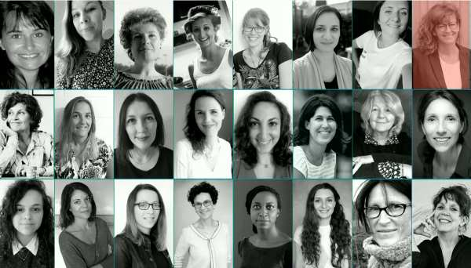
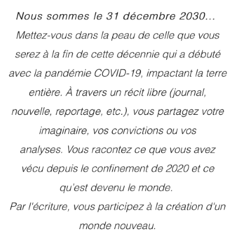

+++
authors = ["OJML"]
title = "Storyt’elles : mots et images"
description = "Carole GALLAND fait partie des premières sociétaires de la coopérative. C’est aussi la « littéraire » de la bande d’entrepreneurs installés à Soisy-sur-Seine."
date = 2021-02-19
[extra]
banner = "sororistas.jpg"
+++

Carole GALLAND fait partie des premières sociétaires de la coopérative. C’est aussi la « littéraire » de la bande d’entrepreneurs installés à Soisy-sur-Seine. Fondatrice de l’agence de communication «  Storyt’elles » et journaliste d’entreprises depuis 20 ans, elle travaille aussi bien pour des collectivités (Paris La Défense, Département Seine-et-Marne, Grand Paris Sud), des grandes institutions (Oeuvre des Orphelins des Douanes) que des grandes entreprises (Bombardier).

Son bureau est rempli de dictionnaires et d’ouvrages sur la littérature. Dans ce bureau surplombant les toits de Soisy-sur-Seine, on a le regard attiré par les posters en photo-montage qu’elle confectionne et offre à ceux qu’elle apprécie.

 

## « Les femmes écrivent le monde de demain »

Si elle vit de sa plume depuis 20 ans, elle n’a jamais osé envoyer ses textes personnels à publier. Mais un jour, un thème, une nouvelle, un collectif féministe lui a soufflé l’évidence. Participer à un concours. Un concours d’écriture aux valeurs de cette agence qui fait la part belle à « **elles** ». [Sororistas](https://www.sororistas.fr/), c’est donc un jury de femmes pour récompenser les femmes.

Et devinez ce qui arriva ! Parmi les 600 participantes francophones, [Carole a été retenue et est donc publiée](https://www.sororistas.fr/prixetrecueil) (et figure parmi les 5 lauréeates podcastées).

Pour obtenir le recueil en version papier, il est gratuit avec tout abonnement au [magazine féministe « Chut »](https://echoppe.chut.media/collections/abonnement).

Pour y accéder en version numérique, vous pouvez retrouver le [recueil complet sur le site](https://3f6b54c6-1024-44af-9830-9a244fe9cf83.filesusr.com/ugd/d1a48a_857e57dbf56c4040ae973358dc0152b8.pdf).

## La vidéo pour prolonger le message

Mais il n’y a pas que les mots, il y a aussi les images. Déjà deux portraits vidéos réalisés par Carole et Lise. Pour s’exercer et valoriser les talents du OUI, l’agence affine ses techniques en video telling sur quelques co-locataires de bureaux à Soisy-sur-Seine. Du coup, vous pouvez découvrir en portrait vidéo + portrait chinois quelques entrepreneurs d’ici. J’étais le cobaye.

Venez maintenant découvrir un nouvel opus dans Talent Express avec [Christelle Rousselin](https://www.youtube.com/watch?v=zXuB6f0s-Xo) !

{{ youtube(id="zXuB6f0s-Xo") }}

[Storyt’elles : l’agence de communication de Carole Galland](https://storytelles.com/)
